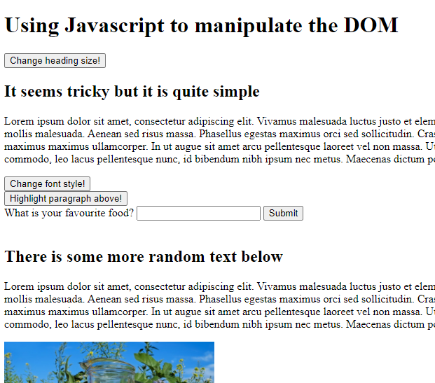
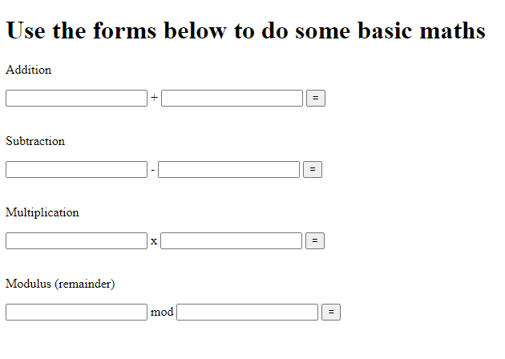
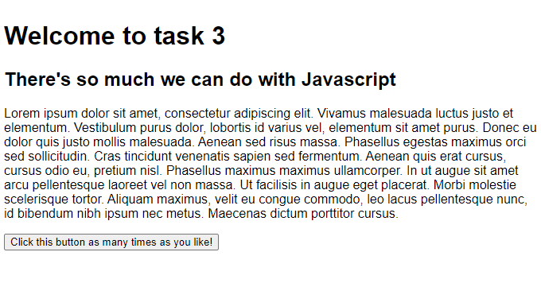
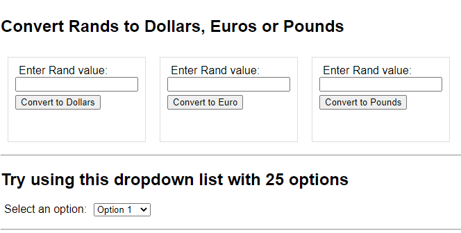
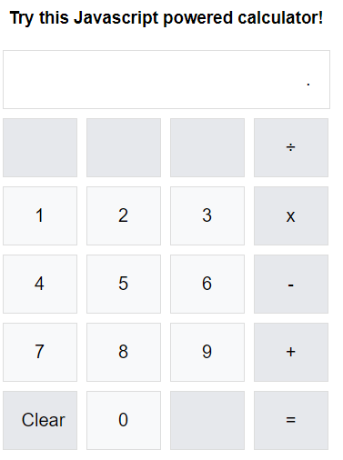

# HyperionDev Full Stack Web Development Bootcamp - Level 1 - Task 10 - Scripting and Event Handling

## Description
This task was my introduction to Scripting and Event Handling using Javascript.

## Table of Contents
* [Instructions](#instructions)
* [Technologies](#technologies)
* [Installation](#installation)
* [Usage](#usage)
* [Credits](#credits) 

## Instructions
There were 3 parts to this task. These were the instructions I was given to guide me:

**Compulsory task 1**
Follow these steps:

* Create a basic HTML file called task1.html with a few headings, paragraphs, forms, and images. Ensure that each item has an ID assigned to it. Create a JavaScript file called task1.js. Save both task1.html and task1.js in a directory called “Task 1” within the “Compulsory Tasks” directory.
* Create buttons to do the following:
    * Change the size of a heading
    * Change the font style of a paragraph
    * Highlight a paragraph
    * Hide an Image
    * Alternate between two images
* Change an image when the mouse moves onto it, and then back to the original image when the mouse moves off of it.
* Create a script which creates an alert on the page when a user right clicks on a specific image.
* Create an alert on the page when a user enters data into a form.
* Create an alert to let the user know when the page has loaded
* Highlight all paragraphs when the mouse moves over them (then revert back once it has moved past them).

**Compulsory task 2**
Follow these steps:

* Modify the basic HTML page called math.html in the “Compulsory Tasks” directory. Create a JavaScript file called task2.js. Modify the HTML and write the JavaScript necessary to create a web page that allows a user to do some basic mathematical computations. The user should be able to enter numbers and press on a button to show the results of the calculation.

**Compulsory task 3**
Follow these steps:

* Create a basic HTML file (called task3.html) with a few headings, paragraphs, forms and images. Ensure that each item has an ID assigned to
it. You will use this HTML page to get input and display output for each task listed below. Write the JavaScript needed in a file called task3.js.
* Create a function which counts and displays the number of times a button has been clicked.
* Create a function to convert rands into dollars, euros and pounds.
* Create a function which creates a drop-down menu with 25 option elements and add it to the HTML page you have created. Each option element should display the number of the option. Use a loop.
* Create a calculator:
    * It should have the layout similar to the calculator on your computer
    * Use CSS to help you style the layout
    * Use JavaScript functions to implement its operation

### Technologies
This project uses:
* HTML 5 
* CSS 3
* Javascript ECMAScript 2021

## Installation
This project created mainly using html and Javascript, so it needs no special installation. Simply open the index.html file for each of the 3 tasks in your browser and enjoy.

## Usage 
**Task 1**
Click on the various buttons on the page to see what they do. Most of them have the expected outcome as the name of the button. For example, "Change font style" or "Change heading size". See figure 1 below.

**Task 2**
Click in the input boxes and type some numbers to add, subtract, multiply or find the Modulus of. Then click the equals button for the result. See figure 2 below.

**Task 3**
The first part of the page lets you click on a button and the script displays a count of the number of times you have clicked it. A bit lower down is a currency convertor to change Rands to Dollars, Euro or Pounds. Then there is a dropdown list that was created with a loop, instead of manually having to code 25 <option> elements. Lastly, is a calculator that can do all 4 basic math operations. You can continue calculating using the answers of previous calculations and click a button to clear the screen as well. See figures 3, 4 and 5 below.

## Credits
This project was created by Evan Malherbe as part of a task for HyperioDev Full Stack Development Bootcamp November 2021 [GitHub profile](https://github.com/evanmalherbe) 
